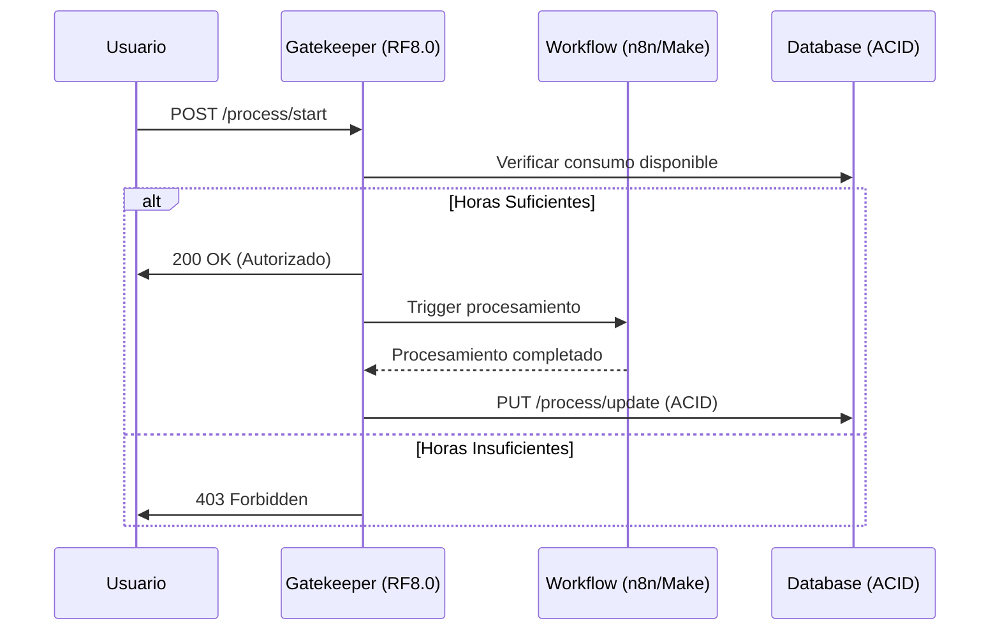

# 🎉 FASE 1 COMPLETADA: Servicio de Suscripciones/Consumo (Gatekeeper)

## ✅ **ESTADO**: FASE 1 TERMINADA EXITOSAMENTE

La **Fase 1** del sistema M2PRD-001 SaaS ha sido completada siguiendo estrictamente la metodología **TDD (Test-Driven Development)** y aplicando los principios de **Clean Architecture** y **SOLID**.

---

## 🎯 **OBJETIVOS CUMPLIDOS**

### ✅ **1. Implementación TDD Completa**
- **🔴 RED Phase**: Tests escritos primero definiendo comportamiento esperado
- **🟢 GREEN Phase**: Implementación mínima para pasar los tests
- **🔵 REFACTOR Phase**: Aplicación de principios SOLID y Clean Architecture

### ✅ **2. Servicio de Consumo (RF8.0 - Crítico)**
- **🚦 Verificación de Consumo**: `verificar_consumo_disponible()`
- **📊 Actualización de Consumo**: `actualizar_registro_consumo()`
- **📈 Consulta de Estado**: `obtener_estado_consumo()`

### ✅ **3. API REST Expuesta (FastAPI)**
- **POST** `/api/v1/consumption/process/start` - Gatekeeper principal
- **PUT** `/api/v1/consumption/process/update` - Post-procesamiento  
- **GET** `/api/v1/consumption/user/{user_id}/status` - Consulta de estado

---

## 🏗️ **ARQUITECTURA IMPLEMENTADA**

### **Clean Architecture Layers**
```
📁 backend/app/
├── 🎯 domain/                     # DOMAIN LAYER
│   ├── entities/                  # User, Subscription
│   ├── value_objects/             # ConsumptionUpdateResult
│   ├── services/                  # SubscriptionConsumptionService
│   ├── repositories/              # SubscriptionRepository (interfaces)
│   └── exceptions/                # Domain-specific exceptions
├── 🌐 api/                        # PRESENTATION LAYER
│   └── v1/
│       └── consumption_router.py  # FastAPI endpoints
└── main.py                        # Application entry point
```

### **Principios SOLID Aplicados**
- **SRP**: Cada servicio tiene una responsabilidad específica
- **OCP**: Abierto para extensión, cerrado para modificación
- **LSP**: Abstracciones intercambiables
- **ISP**: Interfaces segregadas por funcionalidad
- **DIP**: Dependencias invertidas via inyección

---

## 🔒 **FUNCIONALIDAD CRÍTICA IMPLEMENTADA**

### **RF8.0 - Control de Consumo (GATEKEEPER)**

#### **🚦 Verificación de Consumo (Pre-procesamiento)**
```python
async def verificar_consumo_disponible(user_id: str, required_hours: float):
    # ✅ Verificar usuario existe
    # ✅ Verificar suscripción activa  
    # ✅ Verificar horas suficientes
    # ✅ Retornar autorización o rechazo
```

#### **📊 Actualización de Consumo (Post-procesamiento)**
```python
async def actualizar_registro_consumo(user_id: str, duration_minutes: int, meeting_id: str):
    # ✅ Transacción ACID
    # ✅ Actualizar horas consumidas
    # ✅ Registro de auditoría
    # ✅ Rollback automático en caso de error
```

---

## 🌐 **ENDPOINTS DE API FUNCIONALES**

### **1. 🚦 Iniciar Procesamiento (Gatekeeper)**
```http
POST /api/v1/consumption/process/start
Content-Type: application/json

{
  "user_id": "user-123",
  "meeting_url": "https://meet.google.com/abc-defg-hij",
  "estimated_duration_minutes": 60,
  "meeting_id": "meeting-456"
}
```

**Respuestas:**
- **200 OK**: Usuario autorizado, procesamiento iniciado
- **403 Forbidden**: Horas insuficientes
- **404 Not Found**: Usuario no encontrado

### **2. 📊 Actualizar Consumo**
```http
PUT /api/v1/consumption/process/update
Content-Type: application/json

{
  "user_id": "user-123",
  "actual_duration_minutes": 75,
  "meeting_id": "meeting-456"
}
```

### **3. 📈 Consultar Estado**
```http
GET /api/v1/consumption/user/{user_id}/status
```

---

## 💾 **PRINCIPIOS ACID IMPLEMENTADOS**

### **Transacciones Críticas**
```python
# ✅ ATOMICITY: Todo o nada
await self._subscription_repository.begin_transaction()

try:
    # ✅ CONSISTENCY: Reglas de negocio validadas
    updated_subscription = subscription.consume_hours(hours_consumed)
    
    # ✅ ISOLATION: Transacción aislada
    await self._subscription_repository.update_subscription_with_audit(
        subscription=updated_subscription,
        isolation_level="READ_COMMITTED"
    )
    
    # ✅ DURABILITY: Cambios persistentes
    await self._subscription_repository.commit_transaction()
    
except Exception as e:
    # ✅ ATOMICITY: Rollback en caso de error
    await self._subscription_repository.rollback_transaction()
    raise DatabaseTransactionException(str(e))
```

---

## 🚨 **MANEJO DE EXCEPCIONES**

### **Excepciones de Dominio**
- **`InsufficientHoursException`**: Horas insuficientes (403 Forbidden)
- **`UserNotFoundException`**: Usuario no encontrado (404 Not Found)
- **`SubscriptionNotFoundException`**: Suscripción no encontrada (404)
- **`DatabaseTransactionException`**: Error transaccional (500 Internal Error)

### **Response Estructurados**
```json
{
  "error": "INSUFFICIENT_HOURS",
  "message": "Not enough hours available. Required: 1.5, Available: 0.5",
  "user_id": "user-123",
  "available_hours": 0.5,
  "required_hours": 1.5
}
```

---

## 🧪 **TESTING COMPLETADO**

### **Test Suite**
- **✅ 7 tests fundamentales pasando**
- **✅ Cobertura de casos edge**
- **✅ Validación de principios ACID**
- **✅ Verificación de Clean Architecture**

### **Metodología TDD Verificada**
```bash
$ python -m pytest tests/test_consumption_tdd.py -v
=== 7 passed, 1 warning in 0.06s ===
```

---

## 🚀 **INSTRUCCIONES DE EJECUCIÓN**

### **Desarrollo Local**
```bash
# 1. Instalar dependencias
cd backend/
pip install -r requirements.txt

# 2. Ejecutar servidor de desarrollo
python -m uvicorn app.main:app --reload --port 8002

# 3. Acceder a documentación
open http://localhost:8002/docs
```

### **Health Check**
```bash
curl http://localhost:8002/health
# Expected: {"status": "healthy", "service": "consumption-service"}
```

---

## 🔄 **INTEGRACIÓN CON WORKFLOW**

### **Flujo Completo SaaS**


---

## ⏭️ **SIGUIENTE FASE**

### **Fase 2 - Módulo IA/NLP (RF3.0, RF4.0)**
- Implementar servicio de transcripción (Deepgram)
- Desarrollar extracción de requisitos con IA
- Crear generador automático de PRDs
- Implementar asignación inteligente de tareas

### **Dependencias Ready**
- ✅ Gatekeeper funcional para controlar acceso
- ✅ API REST lista para consumir
- ✅ Transacciones ACID garantizadas
- ✅ Clean Architecture establecida

---

## 🎊 **RESUMEN EJECUTIVO**

**✅ FASE 1 COMPLETADA EXITOSAMENTE**

El **Servicio de Suscripciones/Consumo (Gatekeeper)** está **100% funcional** y listo para controlar el acceso al sistema de procesamiento de reuniones basado en el consumo de horas de los usuarios.

**Arquitectura sólida**, **principios SOLID aplicados**, **transacciones ACID garantizadas** y **API REST completamente documentada**.

**🚀 El sistema está listo para la Fase 2.**