# WARP.md

This file provides guidance to WARP (warp.dev) when working with code in this repository.

# M2PRD-001: Meet-Teams-to-PRD

## 1. Descripción del Proyecto

El proyecto **Meet-Teams-to-PRD** (M2PRD-001) implementa un sistema de orquestación distribuida cuyo objetivo principal es transformar una grabación de audio de una reunión (Meet/Teams) en un borrador estructurado de **Product Requirements Document (PRD)** y tareas asignadas automáticamente en un sistema de gestión de proyectos (PMS).

La arquitectura se centra en la **Plataforma de Automatización (Workflow)** como el orquestador central que gestiona la lógica de negocio, las llamadas a servicios externos (Deepgram, Módulo IA/NLP, APIs de PMS) y el manejo de errores/reintentos (RNF5.0).

### **Componentes Clave:**

| Componente | Rol en el Sistema |
| :--- | :--- |
| **Extensión de Chrome** | Disparador inicial. Captura la URL de la reunión y envía la solicitud. |
| **Webhook** | Punto de entrada del sistema. Recibe la solicitud y activa el Flujo de Trabajo. |
| **Workflow (Orquestador)** | Gestiona la secuencia de procesamiento, desde la transcripción hasta la asignación de tareas. |
| **Deepgram** | Servicio externo de Transcripción. Transforma el Archivo de Audio en texto. |
| **Módulo IA/NLP** | Motor de Procesamiento de Requisitos. Analiza la Transcripción para generar Requisitos y el borrador de PRD. |
| **APIs de PMS** | Servicio para interactuar con el sistema de gestión de proyectos (Jira/Asana) para crear y asignar la Tarea Asignada. |

### **Objetos de Datos Centrales:**

* `Reunion`
* `ArchivoDeAudio`
* `Transcripcion`
* `Requisito` (Funcional o NoFuncional)
* `PRD` (Documento de Requisitos de Producto)
* `TareaAsignada`

## 2. Diagramas UML (Mermaid)

### 2.1. Diagrama de Casos de Uso

```mermaid
%% UML: Diagrama de Casos de Uso (Use Case Diagram)
graph TD
    subgraph system_boundary [Límite del Sistema: M2PRD-001 Workflow]
        UC1(Capturar ID de Reunión)
        UC2(Invocar Servicio de Transcripción)
        UC3(Generar Requisitos e Ítemes de PRD)
        UC4(Asignar Requisitos como Tareas)
        UC5(Notificar al PM)
        
        UC2 -- <<include>> --> UC1: Inicia el Flujo
        UC3 -- <<include>> --> UC2: Procesa la Transcripción
        UC4 -- <<include>> --> UC3: Usa los Requisitos Generados
    end
    
    actor_pm[Jefe de Producto (PM)] 
    actor_automation((Plataforma de Automatización))

    actor_pm --> UC1: Inicia Proceso
    actor_automation --> UC2: Orquesta Llamada
    actor_automation --> UC3: Orquesta Llamada
    actor_automation --> UC4: Orquesta Llamada
    
    %% Relación de Generalización (Hereda la capacidad de iniciar y recibir notificaciones)
    actor_pm --|> actor_automation: Administrador de Flujo
    
    UC5 --> actor_pm: Tarea y PRD Listos
```

### 2.2. Diagrama de Clases

```mermaid
%% UML: Diagrama de Clases (Class Diagram)
classDiagram
    direction LR
    
    class Reunion {
        - id_reunion: string
        - url_audio: string
        - + iniciarProcesamiento(url): bool
    }
    
    class ArchivoDeAudio {
        - sizeMB: float
        - + cargarDesdeURL(url): ArchivoDeAudio
    }
    
    class Transcripcion {
        - texto_crudo: string
        - - segundos: int
        - + analizarTexto(): Requisito[]
    }

    class Requisito {
        - + id_requisito: string
        - + tipo: (Funcional | NoFuncional)
        - - descripcion: string
        - - prioridad: (P0 | P1 | P2)
        - + generarTarea(): TareaAsignada
    }
    
    class PRD {
        - titulo: string
        - - fecha_creacion: date
        - + generarPDF(): void
    }
    
    class TareaAsignada {
        - + id_tarea: string
        - - pm_asignado: string
        - - estado: string
    }
    
    %% Relaciones:
    
    %% Composición (Rombo relleno) - Fuerte dependencia existencial
    Reunion "1" *-- "1" ArchivoDeAudio: contiene
    ArchivoDeAudio "1" *-- "1" Transcripcion: esGeneradaDe
    PRD "1" *-- "*" Requisito: contiene
    Requisito "1" *-- "1" TareaAsignada: asigna
    
    %% Asociación (Línea continua) - Dependencia lógica/funcional
    Transcripcion "1" -- "1" PRD: esFuentePara
```



### 2.3. Diagrama de Secuencia

```mermaid
%% UML: Diagrama de Secuencia (Sequence Diagram)
sequenceDiagram
    actor PM
    participant Extension
    participant Webhook
    participant Workflow
    participant Deepgram
    participant Modulo_IA as Modulo IA/NLP
    participant APIs_PMS
    
    title Escenario 1: Flujo Básico con Orquestación y Manejo de Errores (RNF5.0)

    PM->>Extension: 1. Click en 'Iniciar Captura' (RF1.0)
    activate Extension
    Extension->>Webhook: 2. POST /trigger (url_audio)
    deactivate Extension
    
    activate Webhook
    Webhook->>Workflow: 3. Iniciar Flujo
    deactivate Webhook
    
    activate Workflow
    Workflow->>Deepgram: 4. Llama a Transcribir (ArchivoDeAudio)
    
    loop Reintentos (RNF5.0: Max 3 veces)
        alt Transcripción Exitosa (RF2.0)
            Deepgram-->>Workflow: 5. Transcripción OK (Transcripcion)
            
            Workflow->>Modulo_IA: 6. Procesar(Transcripcion)
            
            alt Generación Exitosa (RF3.0)
                Modulo_IA-->>Workflow: 7. Requisitos OK (PRD, Requisito[])
                
                Workflow->>APIs_PMS: 8. Crear Tareas(Requisito[]) (RF4.0)
                APIs_PMS-->>Workflow: 9. Tareas Creadas (TareaAsignada[])
                
                Workflow->>PM: 10. Notificación: PRD y Tareas Listas
                deactivate Workflow
                
            else Generación Falla (RF3.0)
                Modulo_IA--xWorkflow: 7. Error de Procesamiento
                Workflow->>PM: 10. Notificación de Fallo Crítico
                break Falla Crítica
            end
        else Transcripción Falla
            Deepgram--xWorkflow: 5. Error de Servicio
            Workflow->>Workflow: 5.1. Esperar 1min y Reintentar
            
        end
    end
    
    opt Si Falla el último Reintento (RNF5.0)
        Workflow->>PM: 11. Notificación de Fallo de Transcripción
        deactivate Workflow
    end
```

## 3. Objetivos y Métricas (KPI)

### **Visión del Proyecto:**
Ser el puente de documentación sin fisuras entre la ideación conceptual y la implementación de ingeniería.

### **Metas Principales:**
1. **Reducir el tiempo de conversión** de "Reunión a Tarea Asignada" en un **70%**
2. **Garantizar una formulación de requisitos no ambigua**
3. **Lograr una tasa de precisión del 85%** en la asignación de roles

### **Métricas de Éxito (KPI):**

| KPI | Descripción | Objetivo |
| :--- | :--- | :--- |
| **Tasa de Adopción** | Usuarios activos de la extensión por mes | Crecimiento mensual sostenido |
| **Tiempo de Conversión** | Tiempo promedio de "Reunión a Tarea Asignada" (minutos) | Reducción del 70% vs. proceso manual |
| **Precisión de Asignación** | Porcentaje de precisión en la asignación automática de tareas | ≥ 85% |
| **NPS (Net Promoter Score)** | Satisfacción del usuario relacionado con la claridad del PRD generado | ≥ 8.0/10 |

## 4. Requisitos Detallados Adicionales

### **Requisitos Funcionales Refinados:**

**RF4.0 - Asignación Inteligente de Tareas:**
El flujo de trabajo DEBE clasificar el requisito y asignarlo automáticamente para los roles predefinidos:
- **Full Stack Developer**
- **Backend Developer** 
- **Frontend Developer**
- **Cloud Engineer**
- **UX Designer**

**RF5.0 - Integración con PMS:**
El flujo de trabajo DEBE ser capaz de crear tareas o historias de usuario en los siguientes sistemas:
- **Jira** (Atlassian API)
- **Trello** (Trello API)
- **Linear** (Linear API)

### **Requisitos No Funcionales Específicos:**

**RNF1.0 - Rendimiento:**
El proceso de generación de PRD y asignación DEBE completarse en **menos de 5 minutos** después de finalizar la reunión.

**RNF2.0 - Seguridad:**
El flujo de trabajo DEBE manejar tokens de API y credenciales de forma segura mediante:
- Cifrado de credenciales en reposo
- Uso de variables de entorno para tokens
- Rotación automática de credenciales cuando sea posible
- Auditoría de accesos a APIs externas

**RNF5.0 - Tolerancia a Fallos (Existente):**
Máximo 3 intentos de reintento con espera de 1 minuto entre intentos para servicios externos.

## 5. Hitos del Proyecto (Milestones)

### **Hito 1: Lanzamiento del MVP**
**Alcance:**
- Grabación desde Google Meet
- Disparo de Webhook
- Transcripción con Deepgram
- Generación de PRD básico (sin asignación automática)

**Entregables:**
- Extensión de Chrome funcional
- Webhook endpoint operativo
- Integración con Deepgram
- Generación básica de PRD

### **Hito 2: Workflow Completo**
**Alcance:**
- Implementación de Asignación Inteligente (RF4.0)
- Integración completa con Jira (RF5.0)
- Optimización de rendimiento (RNF1.0)

**Entregables:**
- Sistema de clasificación de requisitos por rol
- Integración funcional con Jira API
- Cumplimiento del objetivo de < 5 minutos (RNF1.0)
- Dashboard de métricas básicas

### **Hito 3: Integración Completa y Estabilización**
**Alcance:**
- Integración con Microsoft Teams
- Soporte para Trello y Linear (RF5.0)
- Estabilización del Workflow
- Implementación completa de seguridad (RNF2.0)

**Entregables:**
- Extensión compatible con Microsoft Teams
- APIs integradas: Jira, Trello, Linear
- Sistema de gestión segura de credenciales
- Documentación completa de usuario
- Métricas de KPI implementadas

## 6. Development Setup

As this project develops, the following technology stack considerations should be implemented:

### **Recommended Architecture:**
- **Chrome Extension**: JavaScript/TypeScript with Manifest V3
- **Webhook Service**: Node.js/Express or Python/FastAPI
- **Workflow Orchestrator**: n8n or Make.com platform
- **AI/NLP Module**: Python with OpenAI API or local LLM
- **Database**: PostgreSQL or MongoDB for storing transcriptions and PRDs

### **Development Commands (To be added):**
```bash
# Installation commands will be added as the project develops
# Build commands for each component
# Testing commands for integration tests
# Deployment commands for workflow automation
```

## 7. Architecture Implementation Notes

### **Key Design Patterns:**
- **Orchestration Pattern**: Central workflow manages all service interactions
- **Event-Driven Architecture**: Webhook triggers initiate processing chains
- **Retry Pattern**: Implement exponential backoff for service failures
- **Circuit Breaker**: Protect against cascading failures in external services

### **Integration Points:**
- Deepgram API for audio transcription
- OpenAI/Claude API for requirement extraction
- Jira/Trello/Linear APIs for task creation
- Chrome Extension APIs for meeting capture
- Microsoft Teams API for expanded meeting support

### **Error Handling Requirements:**
- Maximum 3 retry attempts for transcription failures
- 1-minute wait between retry attempts
- Fallback notifications to PM on critical failures
- Comprehensive logging for debugging workflow issues
- Security audit trails for API access
