# Proyecto Warp: Principios de Arquitectura y Buenas Prácticas y Metodología TDD

This file provides guidance to WARP (warp.dev) when working with code in this repository.

## Contexto del Proyecto

[INICIO CONTEXTO DEL PROYECTO]
**M2PRD-001: Meet-Teams-to-PRD** es un sistema distribuido Python/JavaScript que transforma grabaciones de audio de reuniones en documentos PRD estructurados y tareas asignadas automáticamente. Utiliza una arquitectura de microservicios con orquestación centralizada (n8n/Make), procesamiento IA/NLP (Python), persistencia políglota (PostgreSQL/Redis/MongoDB) y despliegue híbrido (Serverless/Contenedores).

**Stack principal**: Python 3.11+, JavaScript/TypeScript, PostgreSQL, Redis, MongoDB, n8n/Make, AWS Lambda, Docker/Kubernetes.
**Dependencias clave**: FastAPI, SQLAlchemy, spaCy, OpenAI, Deepgram SDK, pytest, black, mypy.
[FIN CONTEXTO DEL PROYECTO]

---

## 1. Metodología de Desarrollo: TDD (Test-Driven Development)

### 1.1. Fundamentos del Ciclo TDD

**TDD es el pilar fundamental del desarrollo en M2PRD-001.** Cada funcionalidad debe seguir estrictamente el ciclo **Rojo-Verde-Refactorización**:

```
🔴 RED (Rojo)    → Escribir un test que falle
🟢 GREEN (Verde) → Escribir código mínimo para pasar el test  
🔵 REFACTOR      → Mejorar el código manteniendo los tests pasando
```

### 1.2. Implementación del Ciclo TDD en M2PRD-001

#### **Paso 1: RED - Test que Falla**
```python path=null start=null
# ✅ TDD RED - Comenzamos con el test que define el comportamiento esperado
import pytest
from unittest.mock import Mock
from meeting_processor import MeetingProcessor, ProcessingResult
from exceptions import InvalidMeetingUrlException

class TestMeetingProcessor:
    """✅ TDD - Test First: Definimos comportamiento antes de implementar."""
    
    def test_should_process_google_meet_url_successfully(self):
        """RED: Test que falla inicialmente - define el comportamiento."""
        # Given
        meeting_processor = MeetingProcessor(
            transcription_service=Mock(),
            prd_generator=Mock(),
            task_assigner=Mock()
        )
        meeting_url = "https://meet.google.com/abc-defg-hij"
        
        # When
        result = meeting_processor.process_meeting(meeting_url)
        
        # Then - Define el comportamiento esperado
        assert result.success is True
        assert result.prd is not None
        assert result.processing_time_seconds < 300  # RNF1.0: < 5 minutos
        assert len(result.tasks) > 0
    
    def test_should_reject_invalid_meeting_url(self):
        """RED: Test de validación de entrada."""
        # Given
        meeting_processor = MeetingProcessor(Mock(), Mock(), Mock())
        invalid_url = "not-a-valid-url"
        
        # When & Then
        with pytest.raises(InvalidMeetingUrlException) as exc_info:
            meeting_processor.process_meeting(invalid_url)
        
        assert "Invalid meeting URL" in str(exc_info.value)
```

#### **Paso 2: GREEN - Implementación Mínima**
```python path=null start=null
# ✅ TDD GREEN - Código mínimo para hacer pasar los tests
from dataclasses import dataclass
from typing import List
import re
from abc import ABC, abstractmethod

@dataclass
class ProcessingResult:
    success: bool
    prd: 'PRD' = None
    tasks: List['TareaAsignada'] = None
    processing_time_seconds: float = 0.0

class MeetingProcessor:
    """✅ TDD GREEN - Implementación mínima que satisface los tests."""
    
    def __init__(self, transcription_service, prd_generator, task_assigner):
        self.transcription_service = transcription_service
        self.prd_generator = prd_generator
        self.task_assigner = task_assigner
    
    def process_meeting(self, meeting_url: str) -> ProcessingResult:
        """Implementación mínima para pasar los tests."""
        # Validación básica para pasar el test de URL inválida
        if not self._is_valid_meeting_url(meeting_url):
            raise InvalidMeetingUrlException(f"Invalid meeting URL: {meeting_url}")
        
        # Implementación mínima para pasar el test de éxito
        mock_prd = PRD(id="test-prd", titulo="Test PRD")
        mock_tasks = [TareaAsignada(id_tarea="task-1", descripcion="Test task")]
        
        return ProcessingResult(
            success=True,
            prd=mock_prd,
            tasks=mock_tasks,
            processing_time_seconds=45.0  # < 300 segundos (RNF1.0)
        )
    
    def _is_valid_meeting_url(self, url: str) -> bool:
        """Validación mínima para pasar los tests."""
        valid_patterns = [
            r'https://meet\.google\.com/.+',
            r'https://teams\.microsoft\.com/.+',
            r'https://zoom\.us/.+'
        ]
        return any(re.match(pattern, url) for pattern in valid_patterns)
```

#### **Paso 3: REFACTOR - Mejora del Diseño**
```python path=null start=null
# ✅ TDD REFACTOR - Aplicamos principios SOLID y Clean Architecture
from abc import ABC, abstractmethod
from typing import Protocol
import logging

# Aplicamos ISP (Interface Segregation Principle)
class AudioProcessor(Protocol):
    def process_audio(self, audio_url: str) -> str: pass

class RequirementExtractor(Protocol):
    def extract_requirements(self, transcription: str) -> List['Requisito']: pass

class TaskAssigner(Protocol):
    def assign_tasks(self, requirements: List['Requisito']) -> List['TareaAsignada']: pass

class MeetingProcessor:
    """
    ✅ TDD REFACTOR - Código mejorado manteniendo tests verdes.
    
    Ahora aplica principios SOLID:
    - SRP: Solo procesa reuniones
    - DIP: Depende de abstracciones
    - ISP: Interfaces específicas
    """
    
    def __init__(
        self, 
        audio_processor: AudioProcessor,
        requirement_extractor: RequirementExtractor,
        task_assigner: TaskAssigner,
        logger: logging.Logger = None
    ):
        self.audio_processor = audio_processor
        self.requirement_extractor = requirement_extractor
        self.task_assigner = task_assigner
        self.logger = logger or logging.getLogger(__name__)
    
    def process_meeting(self, meeting_url: str) -> ProcessingResult:
        """✅ REFACTOR - Implementación robusta que mantiene tests verdes."""
        start_time = time.time()
        
        try:
            # Validación mejorada
            self._validate_meeting_url(meeting_url)
            
            # Procesamiento con mejor separación de responsabilidades
            transcription = self.audio_processor.process_audio(meeting_url)
            requirements = self.requirement_extractor.extract_requirements(transcription)
            
            prd = self._generate_prd_from_requirements(requirements)
            tasks = self.task_assigner.assign_tasks(requirements)
            
            processing_time = time.time() - start_time
            
            # Validación de RNF1.0 (< 5 minutos)
            if processing_time > 300:
                self.logger.warning(f"Processing time exceeded 5 minutes: {processing_time}s")
            
            return ProcessingResult(
                success=True,
                prd=prd,
                tasks=tasks,
                processing_time_seconds=processing_time
            )
            
        except Exception as e:
            self.logger.error(f"Meeting processing failed: {str(e)}")
            raise
    
    def _validate_meeting_url(self, url: str) -> None:
        """✅ REFACTOR - Validación extraída a método privado (Clean Code)."""
        if not url or not self._is_valid_meeting_url(url):
            raise InvalidMeetingUrlException(f"Invalid meeting URL: {url}")
    
    def _generate_prd_from_requirements(self, requirements: List[Requisito]) -> PRD:
        """✅ REFACTOR - Lógica de generación de PRD extraída."""
        if not requirements:
            raise ValueError("Cannot generate PRD without requirements")
        
        return PRD(
            id=self._generate_prd_id(),
            titulo=self._extract_title_from_requirements(requirements),
            requirements=requirements,
            fecha_creacion=datetime.now()
        )
```

### 1.3. TDD para Casos de Uso Específicos del Proyecto

#### **TDD para RF4.0 - Asignación Inteligente de Tareas**
```python path=null start=null
# ✅ TDD para Factory Pattern de Asignación de Roles
class TestRoleAssignmentFactory:
    """TDD para RF4.0 - Asignación Inteligente de Tareas."""
    
    def test_should_assign_frontend_developer_for_ui_requirements(self):
        """RED: Test que define comportamiento de clasificación."""
        # Given
        ui_requirement = Requisito(
            descripcion="Necesitamos una interfaz React responsive para el dashboard",
            tipo=RequirementType.FUNCTIONAL
        )
        
        # When
        assigned_role = RoleAssignmentFactory.get_assignee_for_requirement(ui_requirement)
        
        # Then
        assert assigned_role == "Frontend Developer"
    
    def test_should_assign_backend_developer_for_api_requirements(self):
        """RED: Test para clasificación de APIs."""
        # Given
        api_requirement = Requisito(
            descripcion="Implementar API REST para autenticación con JWT",
            tipo=RequirementType.FUNCTIONAL
        )
        
        # When
        assigned_role = RoleAssignmentFactory.get_assignee_for_requirement(api_requirement)
        
        # Then
        assert assigned_role == "Backend Developer"
    
    def test_should_assign_cloud_engineer_for_infrastructure_requirements(self):
        """RED: Test para requisitos de infraestructura."""
        # Given
        infra_requirement = Requisito(
            descripcion="Configurar auto-scaling en AWS Lambda para el procesamiento",
            tipo=RequirementType.NON_FUNCTIONAL
        )
        
        # When
        assigned_role = RoleAssignmentFactory.get_assignee_for_requirement(infra_requirement)
        
        # Then
        assert assigned_role == "Cloud Engineer"

# GREEN: Implementación mínima
class RoleAssignmentFactory:
    """✅ TDD GREEN - Factory que cumple con los tests."""
    
    @classmethod
    def get_assignee_for_requirement(cls, requirement: Requisito) -> str:
        """Implementación mínima para pasar los tests."""
        description_lower = requirement.descripcion.lower()
        
        # Lógica mínima para pasar los tests
        if any(keyword in description_lower for keyword in ['react', 'ui', 'interface', 'dashboard']):
            return "Frontend Developer"
        elif any(keyword in description_lower for keyword in ['api', 'rest', 'jwt', 'autenticación']):
            return "Backend Developer"
        elif any(keyword in description_lower for keyword in ['aws', 'lambda', 'scaling', 'infraestructura']):
            return "Cloud Engineer"
        else:
            return "Full Stack Developer"  # Default

# REFACTOR: Aplicamos Strategy Pattern y mejoramos la clasificación
class RequirementClassificationStrategy(ABC):
    @abstractmethod
    def classify(self, description: str) -> str:
        pass

class KeywordBasedClassifier(RequirementClassificationStrategy):
    """✅ TDD REFACTOR - Estrategia de clasificación basada en keywords."""
    
    def __init__(self):
        self.role_keywords = {
            'Frontend Developer': ['react', 'vue', 'angular', 'ui', 'interface', 'css', 'html', 'responsive'],
            'Backend Developer': ['api', 'rest', 'graphql', 'database', 'sql', 'jwt', 'auth', 'server'],
            'Cloud Engineer': ['aws', 'azure', 'gcp', 'docker', 'kubernetes', 'lambda', 'scaling'],
            'UX Designer': ['ux', 'ui/ux', 'usabilidad', 'usuario', 'diseño', 'mockup']
        }
    
    def classify(self, description: str) -> str:
        description_lower = description.lower()
        
        for role, keywords in self.role_keywords.items():
            if any(keyword in description_lower for keyword in keywords):
                return role
        
        return "Full Stack Developer"

class RoleAssignmentFactory:
    """✅ TDD REFACTOR - Factory mejorado con Strategy Pattern."""
    
    def __init__(self, classifier: RequirementClassificationStrategy = None):
        self.classifier = classifier or KeywordBasedClassifier()
    
    def get_assignee_for_requirement(self, requirement: Requisito) -> str:
        """Método refactorizado que mantiene los tests verdes."""
        return self.classifier.classify(requirement.descripcion)
```

### 1.4. TDD para RNF5.0 - Tolerancia a Fallos (Circuit Breaker)

```python path=null start=null
# ✅ TDD para Circuit Breaker Pattern
class TestCircuitBreaker:
    """TDD para RNF5.0 - Tolerancia a Fallos."""
    
    def test_should_allow_calls_when_circuit_is_closed(self):
        """RED: Test para comportamiento normal del circuit breaker."""
        # Given
        circuit_breaker = CircuitBreaker(failure_threshold=3)
        
        def successful_service_call():
            return "success"
        
        # When
        result = circuit_breaker.call(successful_service_call)
        
        # Then
        assert result == "success"
        assert circuit_breaker.state == CircuitState.CLOSED
    
    def test_should_open_circuit_after_failure_threshold(self):
        """RED: Test para apertura del circuito tras fallos."""
        # Given
        circuit_breaker = CircuitBreaker(failure_threshold=3)
        
        def failing_service_call():
            raise TranscriptionServiceException("Service unavailable")
        
        # When - Ejecutar 3 fallos (threshold)
        for _ in range(3):
            with pytest.raises(TranscriptionServiceException):
                circuit_breaker.call(failing_service_call)
        
        # Then
        assert circuit_breaker.state == CircuitState.OPEN
    
    def test_should_reject_calls_when_circuit_is_open(self):
        """RED: Test para rechazo de calls cuando circuito está abierto."""
        # Given
        circuit_breaker = CircuitBreaker(failure_threshold=1)
        circuit_breaker.state = CircuitState.OPEN
        
        def any_service_call():
            return "should not execute"
        
        # When & Then
        with pytest.raises(CircuitBreakerOpenException):
            circuit_breaker.call(any_service_call)
    
    def test_should_attempt_half_open_after_timeout(self):
        """RED: Test para transición a half-open tras timeout."""
        # Given
        circuit_breaker = CircuitBreaker(failure_threshold=1, timeout=1)
        circuit_breaker.state = CircuitState.OPEN
        circuit_breaker.last_failure_time = time.time() - 2  # 2 segundos atrás
        
        def recovery_test_call():
            return "recovered"
        
        # When
        result = circuit_breaker.call(recovery_test_call)
        
        # Then
        assert result == "recovered"
        assert circuit_breaker.state == CircuitState.CLOSED

# GREEN & REFACTOR: Implementación del Circuit Breaker
from enum import Enum
import time

class CircuitState(Enum):
    CLOSED = "closed"
    OPEN = "open" 
    HALF_OPEN = "half_open"

class CircuitBreaker:
    """✅ TDD - Circuit Breaker implementado siguiendo TDD."""
    
    def __init__(self, failure_threshold: int = 3, timeout: int = 60):
        self.failure_threshold = failure_threshold
        self.timeout = timeout
        self.failure_count = 0
        self.last_failure_time = None
        self.state = CircuitState.CLOSED
    
    def call(self, func, *args, **kwargs):
        """✅ TDD - Método principal que satisface todos los tests."""
        if self.state == CircuitState.OPEN:
            if self._should_attempt_reset():
                self.state = CircuitState.HALF_OPEN
            else:
                raise CircuitBreakerOpenException("Circuit breaker is OPEN")
        
        try:
            result = func(*args, **kwargs)
            self._on_success()
            return result
        except Exception as e:
            self._on_failure()
            raise e
    
    def _should_attempt_reset(self) -> bool:
        """Verifica si debe intentar resetear el circuito."""
        if self.last_failure_time is None:
            return True
        return (time.time() - self.last_failure_time) >= self.timeout
    
    def _on_success(self):
        """Maneja el éxito de una llamada."""
        self.failure_count = 0
        self.state = CircuitState.CLOSED
    
    def _on_failure(self):
        """Maneja el fallo de una llamada."""
        self.failure_count += 1
        self.last_failure_time = time.time()
        
        if self.failure_count >= self.failure_threshold:
            self.state = CircuitState.OPEN
```

---

## 2. Principios de Diseño: SOLID y KISS (Potenciados por TDD)

### 2.1. TDD + Single Responsibility Principle (SRP)

**TDD facilita SRP porque cada test se enfoca en una responsabilidad específica.**

```python path=null start=null
# ✅ TDD + SRP - Cada clase tiene una sola razón para cambiar
class TestTranscriptionService:
    """TDD para servicio con responsabilidad única: transcripción."""
    
    def test_should_transcribe_audio_file_successfully(self):
        """Test enfocado en una sola responsabilidad."""
        # Given
        transcription_service = TranscriptionService(deepgram_client=Mock())
        audio_file = AudioFile(url="http://example.com/audio.mp3", size_mb=5.2)
        
        # When
        result = transcription_service.transcribe(audio_file)
        
        # Then
        assert isinstance(result, str)
        assert len(result) > 0
    
    def test_should_handle_audio_file_too_large(self):
        """Test para manejo de archivos grandes."""
        # Given
        transcription_service = TranscriptionService(deepgram_client=Mock())
        large_audio = AudioFile(url="http://example.com/large.mp3", size_mb=100)
        
        # When & Then
        with pytest.raises(AudioFileTooLargeException):
            transcription_service.transcribe(large_audio)

class TranscriptionService:
    """✅ SRP - Solo se encarga de transcripción de audio."""
    
    def __init__(self, deepgram_client):
        self.deepgram_client = deepgram_client
        self.max_file_size_mb = 50  # Límite de tamaño
    
    def transcribe(self, audio_file: AudioFile) -> str:
        """Única responsabilidad: transcribir audio a texto."""
        self._validate_audio_file(audio_file)
        
        # Llamada a Deepgram API
        response = self.deepgram_client.transcription.prerecorded(
            {'url': audio_file.url},
            {'punctuate': True, 'model': 'nova'}
        )
        
        return self._extract_transcript_text(response)
    
    def _validate_audio_file(self, audio_file: AudioFile) -> None:
        """Validación específica para transcripción."""
        if audio_file.size_mb > self.max_file_size_mb:
            raise AudioFileTooLargeException(
                f"Audio file too large: {audio_file.size_mb}MB > {self.max_file_size_mb}MB"
            )
```

### 2.2. TDD + Dependency Inversion Principle (DIP)

**TDD promueve DIP porque facilita el uso de mocks y abstracciones.**

```python path=null start=null
# ✅ TDD + DIP - Tests usando abstracciones
class TestPRDGenerationService:
    """TDD que promueve inversión de dependencias."""
    
    @pytest.fixture
    def mock_requirement_extractor(self):
        """Mock de la abstracción."""
        mock = Mock(spec=RequirementExtractor)
        mock.extract_requirements.return_value = [
            Requisito(id="req-1", descripcion="Test requirement", tipo=RequirementType.FUNCTIONAL)
        ]
        return mock
    
    @pytest.fixture
    def mock_template_generator(self):
        """Mock de generador de templates."""
        mock = Mock(spec=TemplateGenerator)
        mock.generate_prd_template.return_value = "# Test PRD Template"
        return mock
    
    def test_should_generate_prd_from_transcription(
        self, 
        mock_requirement_extractor, 
        mock_template_generator
    ):
        """TDD usando abstracciones (DIP)."""
        # Given
        prd_service = PRDGenerationService(
            requirement_extractor=mock_requirement_extractor,  # ✅ DIP
            template_generator=mock_template_generator         # ✅ DIP  
        )
        transcription = "We need to implement user authentication and dashboard"
        
        # When
        prd = prd_service.generate_prd(transcription)
        
        # Then
        assert prd is not None
        assert prd.titulo is not None
        assert len(prd.requirements) > 0
        
        # Verificar que usa las abstracciones
        mock_requirement_extractor.extract_requirements.assert_called_once_with(transcription)
        mock_template_generator.generate_prd_template.assert_called_once()

# Abstracciones que facilitan testing
class RequirementExtractor(Protocol):
    def extract_requirements(self, text: str) -> List[Requisito]: pass

class TemplateGenerator(Protocol):
    def generate_prd_template(self, requirements: List[Requisito]) -> str: pass

class PRDGenerationService:
    """✅ DIP - Depende de abstracciones, no de implementaciones concretas."""
    
    def __init__(
        self, 
        requirement_extractor: RequirementExtractor,
        template_generator: TemplateGenerator
    ):
        # ✅ DIP - Dependencias inyectadas como abstracciones
        self.requirement_extractor = requirement_extractor
        self.template_generator = template_generator
    
    def generate_prd(self, transcription: str) -> PRD:
        """Genera PRD usando dependencias abstraídas."""
        requirements = self.requirement_extractor.extract_requirements(transcription)
        
        if not requirements:
            raise ValueError("No requirements found in transcription")
        
        template = self.template_generator.generate_prd_template(requirements)
        
        return PRD(
            id=self._generate_prd_id(),
            titulo=self._generate_title_from_requirements(requirements),
            requirements=requirements,
            template_content=template,
            fecha_creacion=datetime.now()
        )
```

### 2.3. Open/Closed Principle (OCP)

**Implementación para RF5.0 - Integración con PMS:**
```python path=null start=null
from abc import ABC, abstractmethod

# ✅ CUMPLE OCP - Extensible sin modificación
class PMSIntegration(ABC):
    @abstractmethod
    def create_task(self, requirement: Requisito) -> TareaAsignada:
        pass

class JiraIntegration(PMSIntegration):
    def create_task(self, requirement: Requisito) -> TareaAsignada:
        # Implementación específica para Jira
        pass

class TrelloIntegration(PMSIntegration):
    def create_task(self, requirement: Requisito) -> TareaAsignada:
        # Implementación específica para Trello
        pass

class LinearIntegration(PMSIntegration):
    def create_task(self, requirement: Requisito) -> TareaAsignada:
        # Nueva integración sin modificar código existente
        pass

# Factory Pattern para extensibilidad
class PMSIntegrationFactory:
    _integrations = {
        'jira': JiraIntegration,
        'trello': TrelloIntegration,
        'linear': LinearIntegration
    }
    
    @classmethod
    def create_integration(cls, pms_type: str) -> PMSIntegration:
        return cls._integrations[pms_type]()
```

### 2.4. Liskov Substitution Principle (LSP)

**Aplicación en Jerarquía de Requisitos:**
```python path=null start=null
class Requisito(ABC):
    def __init__(self, descripcion: str, prioridad: str):
        self.descripcion = descripcion
        self.prioridad = prioridad
    
    @abstractmethod
    def generar_tarea(self) -> TareaAsignada:
        pass

class RequisitoFuncional(Requisito):
    def generar_tarea(self) -> TareaAsignada:
        # ✅ CUMPLE LSP - Comportamiento consistente con clase base
        return TareaAsignada(
            tipo="funcional",
            descripcion=self.descripcion,
            prioridad=self.prioridad
        )

class RequisitoNoFuncional(Requisito):
    def generar_tarea(self) -> TareaAsignada:
        # ✅ CUMPLE LSP - Comportamiento consistente con clase base
        return TareaAsignada(
            tipo="no_funcional", 
            descripcion=self.descripcion,
            prioridad=self.prioridad
        )
```

### 2.5. Interface Segregation Principle (ISP)

**Interfaces Específicas para Diferentes Responsabilidades:**
```python path=null start=null
# ✅ CUMPLE ISP - Interfaces específicas y cohesivas
class AudioProcessable(Protocol):
    def process_audio(self, audio_data: bytes) -> str:
        pass

class TextAnalyzable(Protocol):
    def extract_requirements(self, text: str) -> List[Requisito]:
        pass

class TaskAssignable(Protocol):
    def assign_to_role(self, requirement: Requisito) -> str:
        pass

class NotificationSender(Protocol):
    def send_notification(self, message: str, recipient: str):
        pass

# Implementación que solo depende de interfaces necesarias
class PRDGenerationService:
    def __init__(
        self, 
        text_analyzer: TextAnalyzable,
        task_assigner: TaskAssignable,
        notifier: NotificationSender
    ):
        # ✅ Solo depende de interfaces que realmente usa
        self.text_analyzer = text_analyzer
        self.task_assigner = task_assigner  
        self.notifier = notifier
```

### 2.6. KISS Principle (Keep It Simple, Stupid)

**Aplicación en Diseño de Componentes:**
```python path=null start=null
# ❌ VIOLACIÓN KISS - Complejidad innecesaria
class ComplexMeetingProcessor:
    def process_with_multiple_algorithms(self, audio):
        # Implementación con múltiples algoritmos, caching complejo,
        # optimizaciones prematuras, configuraciones excesivas
        pass

# ✅ CUMPLE KISS - Implementación simple y directa
class MeetingProcessor:
    def __init__(self, transcription_service: TranscriptionService):
        self.transcription_service = transcription_service
    
    def process_meeting(self, audio_url: str) -> PRD:
        """Procesa una reunión de forma simple y directa."""
        transcription = self.transcription_service.transcribe(audio_url)
        requirements = self._extract_requirements(transcription)
        return self._generate_prd(requirements)
    
    def _extract_requirements(self, transcription: str) -> List[Requisito]:
        # Implementación simple usando bibliotecas estándar
        pass
    
    def _generate_prd(self, requirements: List[Requisito]) -> PRD:
        # Generación directa del PRD
        pass
```

---

## 3. Estrategias de Arquitectura: Clean Architecture (Guiada por TDD)

### 3.1. Capas de Clean Architecture

**Aplicación en M2PRD-001:**

```
┌─────────────────────────────────────────────┐
│ UI/Controllers (Presentation Layer)         │
│ • Chrome Extension                          │
│ • Webhook Endpoints                         │
│ • n8n/Make Workflows                        │
├─────────────────────────────────────────────┤
│ Application Services (Use Cases)            │
│ • ProcessMeetingUseCase                     │
│ • GeneratePRDUseCase                        │
│ • AssignTasksUseCase                        │
├─────────────────────────────────────────────┤
│ Domain Layer (Business Logic)               │
│ • Entities: Reunion, PRD, Requisito        │
│ • Value Objects: AudioFile, Transcripcion  │
│ • Domain Services: RequirementClassifier   │
├─────────────────────────────────────────────┤
│ Infrastructure Layer                        │
│ • Database: PostgreSQL, Redis, MongoDB     │
│ • External APIs: Deepgram, Jira, Linear    │
│ • Cloud Services: AWS Lambda, GCF          │
└─────────────────────────────────────────────┘
```

### 3.2. TDD para Use Cases (Application Layer)

```python path=null start=null
# ✅ TDD para Use Cases - Application Layer
class TestProcessMeetingUseCase:
    """TDD para caso de uso principal del sistema."""
    
    @pytest.fixture
    def setup_use_case_dependencies(self):
        """Setup con todas las dependencias mockeadas."""
        return {
            'meeting_repository': Mock(spec=MeetingRepository),
            'transcription_service': Mock(spec=TranscriptionService), 
            'prd_generator': Mock(spec=PRDGenerationService),
            'task_repository': Mock(spec=TaskRepository),
            'event_publisher': Mock(spec=EventPublisher)
        }
    
    def test_should_execute_complete_meeting_processing_flow(self, setup_use_case_dependencies):
        """RED: Test que define el flujo completo."""
        # Given
        deps = setup_use_case_dependencies
        use_case = ProcessMeetingUseCase(**deps)
        
        command = ProcessMeetingCommand(
            meeting_id="meeting-123",
            audio_url="https://example.com/audio.mp3",
            requester_id="user-456"
        )
        
        # Setup mocks
        mock_meeting = Meeting(id="meeting-123", audio_url=command.audio_url)
        deps['meeting_repository'].get_by_id.return_value = mock_meeting
        deps['transcription_service'].transcribe.return_value = "Mock transcription"
        
        mock_prd = PRD(id="prd-789", titulo="Test PRD")
        deps['prd_generator'].generate_prd.return_value = mock_prd
        
        # When
        response = use_case.execute(command)
        
        # Then - Verificar comportamiento completo
        assert response.success is True
        assert response.prd == mock_prd
        assert response.processing_time_seconds < 300  # RNF1.0
        
        # Verificar secuencia de llamadas (Clean Architecture)
        deps['meeting_repository'].get_by_id.assert_called_once_with("meeting-123")
        deps['transcription_service'].transcribe.assert_called_once()
        deps['prd_generator'].generate_prd.assert_called_once()
        deps['event_publisher'].publish.assert_called_once()

# GREEN: Implementación del Use Case
from dataclasses import dataclass
from typing import List
import time

@dataclass
class ProcessMeetingCommand:
    """Command pattern para entrada del use case."""
    meeting_id: str
    audio_url: str
    requester_id: str

@dataclass  
class ProcessMeetingResponse:
    """Response con resultado del procesamiento."""
    success: bool
    prd: PRD = None
    tasks: List[TareaAsignada] = None
    processing_time_seconds: float = 0.0
    error_message: str = None

class ProcessMeetingUseCase:
    """
    ✅ Clean Architecture + TDD - Use Case en Application Layer.
    
    Orquesta el flujo de procesamiento sin conocer detalles de implementación.
    """
    
    def __init__(
        self,
        meeting_repository: MeetingRepository,
        transcription_service: TranscriptionService,
        prd_generator: PRDGenerationService,
        task_repository: TaskRepository,
        event_publisher: EventPublisher
    ):
        # ✅ Clean Architecture - Dependencias del dominio e infraestructura
        self._meeting_repository = meeting_repository
        self._transcription_service = transcription_service
        self._prd_generator = prd_generator
        self._task_repository = task_repository
        self._event_publisher = event_publisher
    
    def execute(self, command: ProcessMeetingCommand) -> ProcessMeetingResponse:
        """✅ TDD GREEN - Implementación que satisface el test."""
        start_time = time.time()
        
        try:
            # 1. Validar comando
            self._validate_command(command)
            
            # 2. Recuperar reunión (Infrastructure)
            meeting = self._meeting_repository.get_by_id(command.meeting_id)
            if not meeting:
                raise MeetingNotFoundException(f"Meeting {command.meeting_id} not found")
            
            # 3. Transcribir audio (Infrastructure)
            transcription = self._transcription_service.transcribe(meeting.audio_url)
            
            # 4. Generar PRD (Domain Service)
            prd = self._prd_generator.generate_prd(transcription)
            
            # 5. Crear tareas (Domain Logic)
            tasks = self._create_tasks_from_prd(prd)
            
            # 6. Persistir resultados (Infrastructure)
            self._task_repository.save_all(tasks)
            
            # 7. Publicar evento (Infrastructure)
            processing_time = time.time() - start_time
            
            self._event_publisher.publish(
                MeetingProcessedEvent(
                    meeting_id=command.meeting_id,
                    prd_id=prd.id,
                    task_ids=[task.id for task in tasks],
                    processing_time_seconds=processing_time
                )
            )
            
            return ProcessMeetingResponse(
                success=True,
                prd=prd,
                tasks=tasks,
                processing_time_seconds=processing_time
            )
            
        except Exception as e:
            return ProcessMeetingResponse(
                success=False,
                error_message=str(e),
                processing_time_seconds=time.time() - start_time
            )
    
    def _validate_command(self, command: ProcessMeetingCommand) -> None:
        """Validación de entrada del comando."""
        if not command.meeting_id:
            raise ValueError("Meeting ID is required")
        if not command.audio_url:
            raise ValueError("Audio URL is required")
    
    def _create_tasks_from_prd(self, prd: PRD) -> List[TareaAsignada]:
        """Lógica de dominio para crear tareas."""
        return [req.generar_tarea() for req in prd.requirements]
```

### 3.3. TDD para Domain Entities (Domain Layer)

```python path=null start=null
# ✅ TDD para Entidades de Dominio
class TestPRDEntity:
    """TDD para entidad PRD con lógica de dominio rica."""
    
    def test_should_create_prd_with_valid_requirements(self):
        """RED: Test para creación válida de PRD."""
        # Given
        requirements = [
            Requisito(id="req-1", descripcion="User auth", tipo=RequirementType.FUNCTIONAL),
            Requisito(id="req-2", descripcion="Dashboard UI", tipo=RequirementType.FUNCTIONAL)
        ]
        
        # When
        prd = PRD(
            id="prd-123",
            titulo="User Management System",
            requirements=requirements
        )
        
        # Then
        assert prd.id == "prd-123"
        assert len(prd.requirements) == 2
        assert prd.is_valid()
    
    def test_should_reject_prd_without_requirements(self):
        """RED: Test para invariante de dominio."""
        # Given & When & Then
        with pytest.raises(DomainException) as exc_info:
            PRD(
                id="prd-123",
                titulo="Empty PRD",
                requirements=[]  # ❌ Violación de invariante
            )
        
        assert "PRD must have at least one requirement" in str(exc_info.value)
    
    def test_should_generate_all_tasks_from_requirements(self):
        """RED: Test para lógica de dominio."""
        # Given
        requirements = [
            Requisito(id="req-1", descripcion="Frontend component", tipo=RequirementType.FUNCTIONAL),
            Requisito(id="req-2", descripcion="API endpoint", tipo=RequirementType.FUNCTIONAL)
        ]
        
        prd = PRD(id="prd-123", titulo="Test PRD", requirements=requirements)
        mock_assignee_resolver = Mock()
        mock_assignee_resolver.resolve_assignee_for_requirement.side_effect = ["Frontend Developer", "Backend Developer"]
        
        # When
        tasks = prd.generar_todas_las_tareas(mock_assignee_resolver)
        
        # Then
        assert len(tasks) == 2
        assert all(isinstance(task, TareaAsignada) for task in tasks)
        assert tasks[0].assignee == "Frontend Developer"
        assert tasks[1].assignee == "Backend Developer"

# GREEN & REFACTOR: Entidad PRD rica en comportamiento
from dataclasses import dataclass, field
from typing import List
from datetime import datetime
from enum import Enum

class RequirementType(Enum):
    FUNCTIONAL = "funcional"
    NON_FUNCTIONAL = "no_funcional"

@dataclass
class Requisito:
    """✅ TDD - Value Object para requisitos."""
    id: str
    descripcion: str
    tipo: RequirementType
    prioridad: str = "P2"
    
    def generar_tarea(self, assignee_resolver=None) -> 'TareaAsignada':
        """Lógica de dominio para generar tarea."""
        assignee = "Full Stack Developer"  # Default
        
        if assignee_resolver:
            assignee = assignee_resolver.resolve_assignee_for_requirement(self)
        
        return TareaAsignada(
            id_tarea=f"TASK-{self.id}",
            requisito_id=self.id,
            descripcion=self.descripcion,
            assignee=assignee,
            prioridad=self.prioridad
        )

@dataclass
class PRD:
    """
    ✅ TDD - Entidad de dominio rica con invariantes y comportamiento.
    
    Aggregate Root que encapsula la lógica de negocio de los PRDs.
    """
    id: str
    titulo: str
    requirements: List[Requisito]
    fecha_creacion: datetime = field(default_factory=datetime.now)
    
    def __post_init__(self):
        """Validación de invariantes de dominio."""
        self._validate_domain_invariants()
    
    def is_valid(self) -> bool:
        """Verifica si el PRD cumple con las reglas de dominio."""
        try:
            self._validate_domain_invariants()
            return True
        except DomainException:
            return False
    
    def add_requirement(self, requirement: Requisito) -> None:
        """Añade un requisito manteniendo invariantes."""
        if not requirement:
            raise ValueError("Requirement cannot be None")
        
        self.requirements.append(requirement)
    
    def generar_todas_las_tareas(self, assignee_resolver) -> List['TareaAsignada']:
        """
        ✅ TDD - Lógica de dominio para generar todas las tareas.
        
        Business Logic: Un PRD genera tareas basadas en sus requisitos.
        """
        if not self.requirements:
            raise DomainException("Cannot generate tasks from empty requirements")
        
        return [req.generar_tarea(assignee_resolver) for req in self.requirements]
    
    def calcular_complejidad(self) -> str:
        """Lógica de dominio para calcular complejidad del PRD."""
        num_requirements = len(self.requirements)
        
        if num_requirements <= 3:
            return "BAJA"
        elif num_requirements <= 8:
            return "MEDIA"
        else:
            return "ALTA"
    
    def _validate_domain_invariants(self) -> None:
        """✅ Domain-Driven Design - Validación de invariantes."""
        if not self.requirements:
            raise DomainException("PRD must have at least one requirement")
        
        if len(self.titulo) < 5:
            raise DomainException("PRD title must be at least 5 characters")
        
        # Validar que no hay requisitos duplicados
        requirement_ids = [req.id for req in self.requirements]
        if len(requirement_ids) != len(set(requirement_ids)):
            raise DomainException("PRD cannot have duplicate requirements")

@dataclass
class TareaAsignada:
    """Value Object para tareas asignadas."""
    id_tarea: str
    requisito_id: str
    descripcion: str
    assignee: str
    prioridad: str = "P2"
    estado: str = "PENDIENTE"

class DomainException(Exception):
    """Excepción específica de dominio."""
    pass
```

### 3.4. Ports & Adapters (Hexagonal Architecture)

```python path=null start=null
# ✅ PORTS & ADAPTERS - Definición de puertos
from abc import ABC, abstractmethod

# PUERTOS (Interfaces)
class TranscriptionService(ABC):
    @abstractmethod
    def transcribe(self, audio_url: str, api_key: str) -> str:
        pass

class SecretManager(ABC):
    @abstractmethod
    def get_secret(self, secret_name: str) -> str:
        pass

class PMSIntegration(ABC):
    @abstractmethod
    def create_task(self, task: TareaAsignada) -> str:
        pass

# ADAPTADORES (Implementaciones)
class DeepgramTranscriptionAdapter(TranscriptionService):
    def __init__(self, deepgram_client):
        self.client = deepgram_client
    
    def transcribe(self, audio_url: str, api_key: str) -> str:
        # ✅ Implementación específica de Deepgram
        response = self.client.transcription.prerecorded(
            {'url': audio_url}, 
            {'punctuate': True, 'model': 'nova'}
        )
        return response['results']['channels'][0]['alternatives'][0]['transcript']

class AWSSecretsManagerAdapter(SecretManager):
    def __init__(self, aws_client):
        self.client = aws_client
    
    def get_secret(self, secret_name: str) -> str:
        # ✅ Implementación específica de AWS
        response = self.client.get_secret_value(SecretId=secret_name)
        return response['SecretString']

class JiraIntegrationAdapter(PMSIntegration):
    def __init__(self, jira_client):
        self.client = jira_client
    
    def create_task(self, task: TareaAsignada) -> str:
        # ✅ Implementación específica de Jira
        issue_data = {
            'project': {'key': 'PRD'},
            'summary': task.descripcion,
            'description': f"Requisito: {task.requisito_id}",
            'issuetype': {'name': 'Task'},
            'assignee': {'name': task.assignee},
            'priority': {'name': task.prioridad}
        }
        issue = self.client.create_issue(fields=issue_data)
        return issue.key
```

---

## 4. Patrones de Diseño Aplicados

### 4.1. Factory Pattern

**Aplicación para RF4.0 - Asignación Inteligente:**
```python path=null start=null
class RoleAssignmentFactory:
    """Factory para resolver asignación de roles basado en tipo de requisito."""
    
    _role_mappings = {
        'ui_requirement': 'Frontend Developer',
        'api_requirement': 'Backend Developer', 
        'database_requirement': 'Backend Developer',
        'infrastructure_requirement': 'Cloud Engineer',
        'user_experience': 'UX Designer',
        'full_stack': 'Full Stack Developer'
    }
    
    @classmethod
    def get_assignee_for_requirement(cls, requisito: Requisito) -> str:
        requirement_type = cls._classify_requirement(requisito.descripcion)
        return cls._role_mappings.get(requirement_type, 'Full Stack Developer')
    
    @classmethod
    def _classify_requirement(cls, descripcion: str) -> str:
        # ✅ Factory Method - Lógica de clasificación centralizada
        descripcion_lower = descripcion.lower()
        
        if any(keyword in descripcion_lower for keyword in ['ui', 'interface', 'frontend', 'react']):
            return 'ui_requirement'
        elif any(keyword in descripcion_lower for keyword in ['api', 'backend', 'server', 'python']):
            return 'api_requirement'
        elif any(keyword in descripcion_lower for keyword in ['database', 'postgresql', 'redis']):
            return 'database_requirement'
        elif any(keyword in descripcion_lower for keyword in ['cloud', 'aws', 'docker', 'kubernetes']):
            return 'infrastructure_requirement'
        elif any(keyword in descripcion_lower for keyword in ['ux', 'user', 'design', 'usability']):
            return 'user_experience'
        else:
            return 'full_stack'
```

### 4.2. Strategy Pattern

**Aplicación para Diferentes Algoritmos de NLP:**
```python path=null start=null
from abc import ABC, abstractmethod

class RequirementExtractionStrategy(ABC):
    @abstractmethod
    def extract_requirements(self, transcription: str) -> List[Requisito]:
        pass

class SpacyRequirementExtractor(RequirementExtractionStrategy):
    def __init__(self, nlp_model):
        self.nlp = nlp_model
    
    def extract_requirements(self, transcription: str) -> List[Requisito]:
        # ✅ STRATEGY - Implementación específica con spaCy
        doc = self.nlp(transcription)
        requirements = []
        
        for sent in doc.sents:
            if self._is_requirement_sentence(sent):
                req = self._create_requirement_from_sentence(sent)
                requirements.append(req)
        
        return requirements

class OpenAIRequirementExtractor(RequirementExtractionStrategy):
    def __init__(self, openai_client):
        self.client = openai_client
    
    def extract_requirements(self, transcription: str) -> List[Requisito]:
        # ✅ STRATEGY - Implementación específica con OpenAI
        prompt = f"""
        Extrae los requisitos funcionales y no funcionales de la siguiente transcripción:
        {transcription}
        
        Formato JSON: [{{"tipo": "funcional|no_funcional", "descripcion": "...", "prioridad": "P0|P1|P2"}}]
        """
        
        response = self.client.chat.completions.create(
            model="gpt-4",
            messages=[{"role": "user", "content": prompt}]
        )
        
        return self._parse_openai_response(response)

# Context que usa las estrategias
class PRDGenerationService:
    def __init__(self, extraction_strategy: RequirementExtractionStrategy):
        self.extraction_strategy = extraction_strategy
    
    def generate_prd(self, transcription: str) -> PRD:
        # ✅ STRATEGY - El contexto delega la extracción a la estrategia
        requirements = self.extraction_strategy.extract_requirements(transcription)
        
        return PRD(
            id=self._generate_prd_id(),
            titulo=self._extract_title_from_transcription(transcription),
            fecha_creacion=datetime.now(),
            requirements=requirements
        )
```

### 4.3. Observer Pattern

**Aplicación para Notificaciones (RF - Notificar al PM):**
```python path=null start=null
from abc import ABC, abstractmethod
from typing import List

class MeetingProcessingObserver(ABC):
    @abstractmethod
    def on_processing_started(self, meeting_id: str):
        pass
    
    @abstractmethod
    def on_processing_completed(self, meeting_id: str, prd: PRD, tasks: List[TareaAsignada]):
        pass
    
    @abstractmethod 
    def on_processing_failed(self, meeting_id: str, error: Exception):
        pass

class EmailNotificationObserver(MeetingProcessingObserver):
    def __init__(self, email_service: EmailService):
        self.email_service = email_service
    
    def on_processing_started(self, meeting_id: str):
        # ✅ OBSERVER - Notificación específica por email
        self.email_service.send_email(
            subject=f"Procesamiento iniciado - Reunión {meeting_id}",
            body="El procesamiento de la reunión ha comenzado...",
            recipients=self._get_pm_emails()
        )
    
    def on_processing_completed(self, meeting_id: str, prd: PRD, tasks: List[TareaAsignada]):
        # ✅ OBSERVER - Notificación de finalización exitosa
        task_summary = self._create_task_summary(tasks)
        self.email_service.send_email(
            subject=f"PRD y tareas listos - Reunión {meeting_id}",
            body=f"PRD generado: {prd.titulo}\nTareas creadas: {task_summary}",
            recipients=self._get_pm_emails(),
            attachments=[prd.generar_pdf()]
        )

class SlackNotificationObserver(MeetingProcessingObserver):
    def __init__(self, slack_client):
        self.slack_client = slack_client
    
    def on_processing_completed(self, meeting_id: str, prd: PRD, tasks: List[TareaAsignada]):
        # ✅ OBSERVER - Notificación específica por Slack
        message = f"""
        ✅ Reunión {meeting_id} procesada exitosamente
        📄 PRD: {prd.titulo}
        📋 Tareas creadas: {len(tasks)}
        """
        self.slack_client.send_message(channel="#pm-notifications", message=message)

# Subject (Observable)
class MeetingProcessor:
    def __init__(self):
        self._observers: List[MeetingProcessingObserver] = []
    
    def add_observer(self, observer: MeetingProcessingObserver):
        self._observers.append(observer)
    
    def remove_observer(self, observer: MeetingProcessingObserver):
        self._observers.remove(observer)
    
    def _notify_processing_started(self, meeting_id: str):
        for observer in self._observers:
            observer.on_processing_started(meeting_id)
    
    def _notify_processing_completed(self, meeting_id: str, prd: PRD, tasks: List[TareaAsignada]):
        for observer in self._observers:
            observer.on_processing_completed(meeting_id, prd, tasks)
    
    def process_meeting(self, meeting_id: str) -> ProcessingResult:
        self._notify_processing_started(meeting_id)
        
        try:
            # Lógica de procesamiento...
            prd = self._generate_prd()
            tasks = self._create_tasks()
            
            self._notify_processing_completed(meeting_id, prd, tasks)
            return ProcessingResult(success=True, prd=prd, tasks=tasks)
            
        except Exception as e:
            self._notify_processing_failed(meeting_id, e)
            raise
```

### 4.4. Circuit Breaker Pattern

**Aplicación para RNF5.0 - Tolerancia a Fallos:**
```python path=null start=null
import time
from enum import Enum
from typing import Callable, Any

class CircuitState(Enum):
    CLOSED = "closed"      # Funcionando normalmente
    OPEN = "open"          # Circuito abierto, fallos detectados  
    HALF_OPEN = "half_open" # Probando si el servicio se recuperó

class CircuitBreaker:
    def __init__(
        self, 
        failure_threshold: int = 5,
        timeout: int = 60,
        expected_exception: type = Exception
    ):
        self.failure_threshold = failure_threshold
        self.timeout = timeout
        self.expected_exception = expected_exception
        
        self.failure_count = 0
        self.last_failure_time = None
        self.state = CircuitState.CLOSED
    
    def call(self, func: Callable, *args, **kwargs) -> Any:
        """✅ CIRCUIT BREAKER - Protege llamadas a servicios externos."""
        
        if self.state == CircuitState.OPEN:
            if self._should_attempt_reset():
                self.state = CircuitState.HALF_OPEN
            else:
                raise CircuitBreakerOpenException("Circuit breaker is OPEN")
        
        try:
            result = func(*args, **kwargs)
            self._on_success()
            return result
            
        except self.expected_exception as e:
            self._on_failure()
            raise e
    
    def _should_attempt_reset(self) -> bool:
        return (time.time() - self.last_failure_time) >= self.timeout
    
    def _on_success(self):
        self.failure_count = 0
        self.state = CircuitState.CLOSED
    
    def _on_failure(self):
        self.failure_count += 1
        self.last_failure_time = time.time()
        
        if self.failure_count >= self.failure_threshold:
            self.state = CircuitState.OPEN

# Aplicación en servicios externos
class RobustTranscriptionService:
    def __init__(self, transcription_service: TranscriptionService):
        self.service = transcription_service
        self.circuit_breaker = CircuitBreaker(
            failure_threshold=3,  # RNF5.0: Máximo 3 reintentos
            timeout=60,           # RNF5.0: Esperar 1 minuto
            expected_exception=TranscriptionServiceException
        )
    
    def transcribe_with_protection(self, audio_url: str, api_key: str) -> str:
        """✅ Transcripción protegida por Circuit Breaker."""
        return self.circuit_breaker.call(
            self.service.transcribe, 
            audio_url, 
            api_key
        )
```

---

## 5. Bases de Datos: Principios ACID (Validados con TDD)

### 5.1. TDD para Transacciones ACID

```python path=null start=null
# ✅ TDD para principios ACID
class TestDatabaseTransactionManager:
    """TDD para gestión de transacciones ACID."""
    
    @pytest.fixture
    def db_manager(self):
        """Setup de manager con BD en memoria."""
        engine = create_engine("sqlite:///:memory:")
        Base.metadata.create_all(engine)
        return DatabaseTransactionManager(engine)
    
    def test_should_commit_transaction_when_successful(self, db_manager):
        """RED: Test para propiedad ATOMICITY y DURABILITY."""
        # Given
        meeting = Meeting(id="meeting-123", audio_url="http://example.com/audio.mp3")
        prd = PRD(id="prd-456", titulo="Test PRD", requirements=[])
        
        # When
        with db_manager.transaction() as session:
            session.add(meeting)
            session.add(prd)
            # Transacción exitosa, debe hacer commit automáticamente
        
        # Then - Verificar DURABILITY
        with db_manager.transaction() as session:
            saved_meeting = session.get(Meeting, "meeting-123")
            saved_prd = session.get(PRD, "prd-456")
            
            assert saved_meeting is not None
            assert saved_prd is not None
    
    def test_should_rollback_transaction_when_error_occurs(self, db_manager):
        """RED: Test para propiedad ATOMICITY en caso de error."""
        # Given
        meeting = Meeting(id="meeting-123", audio_url="http://example.com/audio.mp3")
        
        # When - Simular error en transacción
        with pytest.raises(ValueError):
            with db_manager.transaction() as session:
                session.add(meeting)
                session.flush()  # Asegurar que se agregó temporalmente
                raise ValueError("Simulated error")  # Error que debe causar rollback
        
        # Then - Verificar ATOMICITY (rollback)
        with db_manager.transaction() as session:
            saved_meeting = session.get(Meeting, "meeting-123")
            assert saved_meeting is None  # No debe existir debido al rollback
    
    def test_should_maintain_consistency_with_validation(self, db_manager):
        """RED: Test para propiedad CONSISTENCY."""
        # Given
        invalid_meeting = Meeting(id="", audio_url="")  # Datos inválidos
        
        # When & Then - La validación debe mantener consistencia
        with pytest.raises(ValueError) as exc_info:
            with db_manager.transaction() as session:
                # La validación debe ocurrir antes del commit
                self._validate_meeting_data(invalid_meeting)
                session.add(invalid_meeting)
        
        assert "Meeting must have valid ID" in str(exc_info.value)
    
    def test_should_handle_concurrent_access_with_isolation(self, db_manager):
        """RED: Test para propiedad ISOLATION."""
        # Given
        meeting_id = "concurrent-meeting"
        
        # When - Simular acceso concurrente
        def transaction_1():
            with db_manager.transaction() as session:
                meeting = Meeting(id=meeting_id, audio_url="http://example.com/audio1.mp3")
                session.add(meeting)
                time.sleep(0.1)  # Simular procesamiento
                # Esta transacción debe completarse sin interferencias
        
        def transaction_2():
            time.sleep(0.05)  # Empezar ligeramente después
            with db_manager.transaction() as session:
                # Debe poder leer datos consistentes
                meeting = session.get(Meeting, meeting_id)
                return meeting
        
        # Ejecutar concurrentemente (en pruebas reales usaríamos threading)
        transaction_1()
        result = transaction_2()
        
        # Then - ISOLATION mantenida
        assert result is not None
        assert result.id == meeting_id

# GREEN: Implementación del Transaction Manager
from contextlib import contextmanager
from sqlalchemy import create_engine
from sqlalchemy.orm import sessionmaker, Session
from typing import Generator

class DatabaseTransactionManager:
    """✅ TDD - Gestor de transacciones que garantiza propiedades ACID."""
    
    def __init__(self, engine=None, database_url: str = None):
        if engine:
            self.engine = engine
        elif database_url:
            self.engine = create_engine(database_url)
        else:
            raise ValueError("Either engine or database_url must be provided")
            
        self.SessionLocal = sessionmaker(bind=self.engine)
    
    @contextmanager
    def transaction(self) -> Generator[Session, None, None]:
        """
        ✅ ACID Context Manager que garantiza:
        - ATOMICITY: Todo o nada mediante commit/rollback
        - CONSISTENCY: Validaciones antes del commit
        - ISOLATION: Sesiones aisladas por transacción
        - DURABILITY: Cambios persistentes tras commit exitoso
        """
        session = self.SessionLocal()
        try:
            yield session
            session.commit()  # ✅ ATOMICITY & DURABILITY
        except Exception as e:
            session.rollback()  # ✅ ATOMICITY - Todo o nada
            raise e
        finally:
            session.close()  # ✅ ISOLATION - Limpieza de sesión
    
    def _validate_meeting_data(self, meeting: Meeting) -> None:
        """✅ CONSISTENCY - Validación de reglas de negocio."""
        if not meeting.id:
            raise ValueError("Meeting must have valid ID")
        if not meeting.audio_url:
            raise ValueError("Meeting must have audio URL")

# REFACTOR: Repository con manejo ACID
class MeetingRepository:
    """✅ TDD REFACTOR - Repository que usa principios ACID."""
    
    def __init__(self, db_manager: DatabaseTransactionManager):
        self.db_manager = db_manager
    
    def save_meeting_with_prd_and_tasks(
        self, 
        meeting: Meeting, 
        prd: PRD, 
        tasks: List[TareaAsignada]
    ) -> None:
        """✅ ACID - Operación atómica completa."""
        
        with self.db_manager.transaction() as session:
            # ✅ CONSISTENCY - Validaciones de integridad
            self._validate_meeting_data(meeting)
            self._validate_prd_data(prd)
            self._validate_tasks_data(tasks)
            
            # ✅ ATOMICITY - Todo en una transacción
            session.add(meeting)
            session.add(prd)
            session.add_all(tasks)
            
            # Establecer relaciones
            prd.reunion_id = meeting.id
            for task in tasks:
                task.prd_id = prd.id
            
            # ✅ ISOLATION - La transacción se ejecuta aisladamente
            # ✅ DURABILITY - Los cambios persisten al hacer commit
    
    def _validate_meeting_data(self, meeting: Meeting) -> None:
        """CONSISTENCY - Validaciones de reglas de negocio."""
        if not meeting.url_audio:
            raise ValueError("Meeting must have audio URL")
        if not meeting.id_reunion:
            raise ValueError("Meeting must have valid ID")
    
    def _validate_prd_data(self, prd: PRD) -> None:
        """CONSISTENCY - Validaciones de PRD."""
        if not prd.requirements:
            raise ValueError("PRD must have at least one requirement")
        if len(prd.titulo) < 5:
            raise ValueError("PRD title must be at least 5 characters")
    
    def _validate_tasks_data(self, tasks: List[TareaAsignada]) -> None:
        """CONSISTENCY - Validaciones de tareas."""
        valid_roles = [
            'Frontend Developer', 'Backend Developer', 'Full Stack Developer', 
            'Cloud Engineer', 'UX Designer'
        ]
        
        for task in tasks:
            if task.assignee not in valid_roles:
                raise ValueError(f"Invalid role assignment: {task.assignee}")
```

### 5.2. Implementación de Transacciones ACID

```python path=null start=null
from contextlib import contextmanager
from sqlalchemy import create_engine
from sqlalchemy.orm import sessionmaker, Session
from typing import Generator

class DatabaseTransactionManager:
    """✅ ACID - Gestor de transacciones que garantiza propiedades ACID."""
    
    def __init__(self, database_url: str):
        self.engine = create_engine(database_url)
        self.SessionLocal = sessionmaker(bind=self.engine)
    
    @contextmanager
    def transaction(self) -> Generator[Session, None, None]:
        """
        ✅ ACID - Context manager que garantiza:
        - Atomicity: Todo o nada
        - Consistency: Reglas de integridad
        - Isolation: Transacciones aisladas  
        - Durability: Cambios persistentes
        """
        session = self.SessionLocal()
        try:
            yield session
            session.commit()  # ✅ ATOMICITY & DURABILITY
        except Exception as e:
            session.rollback()  # ✅ ATOMICITY - Rollback en caso de error
            raise e
        finally:
            session.close()

class MeetingRepository:
    def __init__(self, db_manager: DatabaseTransactionManager):
        self.db_manager = db_manager
    
    def save_meeting_with_prd_and_tasks(
        self, 
        meeting: Reunion, 
        prd: PRD, 
        tasks: List[TareaAsignada]
    ) -> None:
        """✅ ACID - Operación atómica completa."""
        
        with self.db_manager.transaction() as session:
            # ✅ CONSISTENCY - Validaciones de integridad
            self._validate_meeting_data(meeting)
            self._validate_prd_data(prd)
            self._validate_tasks_data(tasks)
            
            # ✅ ATOMICITY - Todo en una transacción
            session.add(meeting)
            session.add(prd)
            session.add_all(tasks)
            
            # ✅ CONSISTENCY - Relaciones consistentes
            prd.reunion_id = meeting.id
            for task in tasks:
                task.prd_id = prd.id
            
            # ✅ ISOLATION - La transacción se ejecuta de forma aislada
            # ✅ DURABILITY - Los cambios persisten al hacer commit
    
    def _validate_meeting_data(self, meeting: Reunion) -> None:
        """✅ CONSISTENCY - Validaciones de reglas de negocio."""
        if not meeting.url_audio:
            raise ValueError("Meeting must have audio URL")
        if not meeting.id_reunion:
            raise ValueError("Meeting must have valid ID")
    
    def _validate_prd_data(self, prd: PRD) -> None:
        """✅ CONSISTENCY - Validaciones de PRD."""
        if not prd.requirements:
            raise ValueError("PRD must have at least one requirement")
        if len(prd.titulo) < 5:
            raise ValueError("PRD title must be at least 5 characters")
    
    def _validate_tasks_data(self, tasks: List[TareaAsignada]) -> None:
        """✅ CONSISTENCY - Validaciones de tareas."""
        valid_roles = ['Frontend Developer', 'Backend Developer', 'Full Stack Developer', 'Cloud Engineer', 'UX Designer']
        
        for task in tasks:
            if task.pm_asignado not in valid_roles:
                raise ValueError(f"Invalid role assignment: {task.pm_asignado}")
```

### 5.3. Gestión de Concurrent Access

```python path=null start=null
from sqlalchemy import select, text
from sqlalchemy.exc import IntegrityError
import redis

class ConcurrentMeetingProcessor:
    """✅ ACID - Gestión de concurrencia para procesamiento de reuniones."""
    
    def __init__(self, db_manager: DatabaseTransactionManager, redis_client: redis.Redis):
        self.db_manager = db_manager
        self.redis = redis_client
    
    def process_meeting_safely(self, meeting_id: str) -> ProcessingResult:
        """✅ ISOLATION - Procesa reunión evitando condiciones de carrera."""
        
        lock_key = f"meeting_processing:{meeting_id}"
        
        # ✅ ISOLATION - Lock distribuido para evitar procesamiento concurrente
        with self.redis.lock(lock_key, timeout=300):  # 5 minutos timeout
            
            with self.db_manager.transaction() as session:
                # ✅ ISOLATION - Select con FOR UPDATE evita lecturas sucias
                meeting = session.execute(
                    select(Meeting)
                    .where(Meeting.id == meeting_id)
                    .with_for_update()  # Bloqueo pesimista
                ).scalar_one_or_none()
                
                if not meeting:
                    raise MeetingNotFoundException(f"Meeting {meeting_id} not found")
                
                if meeting.status == 'PROCESSING':
                    raise MeetingAlreadyProcessingException(
                        f"Meeting {meeting_id} is already being processed"
                    )
                
                # ✅ CONSISTENCY - Actualización atómica de estado
                meeting.status = 'PROCESSING'
                meeting.processing_started_at = datetime.utcnow()
                
                try:
                    # Procesamiento de la reunión
                    result = self._do_processing(meeting)
                    
                    # ✅ ATOMICITY - Todo o nada
                    meeting.status = 'COMPLETED'
                    meeting.processing_completed_at = datetime.utcnow()
                    
                    return result
                    
                except Exception as e:
                    # ✅ CONSISTENCY - Estado consistente en caso de error
                    meeting.status = 'FAILED'
                    meeting.error_message = str(e)
                    raise e
```

---

## 6. Gestión de Calidad de Código

### 6.1. Clean Code Principles

```python path=null start=null
# ✅ CLEAN CODE - Nombres descriptivos y funciones pequeñas
class MeetingAudioProcessor:
    """Procesador de audio de reuniones con principios de Clean Code."""
    
    def process_meeting_audio(self, meeting_url: str) -> ProcessingResult:
        """
        ✅ CLEAN CODE - Función con una sola responsabilidad y nombre descriptivo.
        
        Args:
            meeting_url: URL de la reunión a procesar
            
        Returns:
            ProcessingResult: Resultado del procesamiento con PRD y tareas
            
        Raises:
            InvalidMeetingUrlException: Si la URL no es válida
            TranscriptionFailedException: Si falla la transcripción
        """
        self._validate_meeting_url(meeting_url)
        
        audio_file = self._extract_audio_from_meeting(meeting_url)
        transcription = self._transcribe_audio_safely(audio_file)
        requirements = self._extract_requirements_from_transcription(transcription)
        prd = self._generate_prd_from_requirements(requirements)
        tasks = self._create_tasks_from_prd(prd)
        
        return ProcessingResult(prd=prd, tasks=tasks)
    
    def _validate_meeting_url(self, url: str) -> None:
        """✅ CLEAN CODE - Función pequeña con propósito específico."""
        if not url or not self._is_valid_meeting_url(url):
            raise InvalidMeetingUrlException(f"Invalid meeting URL: {url}")
    
    def _is_valid_meeting_url(self, url: str) -> bool:
        """✅ CLEAN CODE - Función booleana con nombre claro."""
        valid_patterns = [
            r'https://meet\.google\.com/',
            r'https://teams\.microsoft\.com/',
            r'https://zoom\.us/'
        ]
        return any(re.match(pattern, url) for pattern in valid_patterns)
    
    def _extract_audio_from_meeting(self, meeting_url: str) -> AudioFile:
        """✅ CLEAN CODE - Abstracción clara del proceso."""
        # Implementación específica extraída a método privado
        pass
    
    def _transcribe_audio_safely(self, audio_file: AudioFile) -> Transcription:
        """✅ CLEAN CODE - Manejo de errores explícito en el nombre."""
        max_retries = 3
        retry_count = 0
        
        while retry_count < max_retries:
            try:
                return self.transcription_service.transcribe(audio_file)
            except TranscriptionServiceException as e:
                retry_count += 1
                if retry_count >= max_retries:
                    raise TranscriptionFailedException(
                        f"Failed to transcribe after {max_retries} attempts"
                    ) from e
                self._wait_before_retry(retry_count)
    
    def _wait_before_retry(self, retry_count: int) -> None:
        """✅ CLEAN CODE - Responsabilidad específica extraída."""
        wait_time = min(60, 2 ** retry_count)  # Exponential backoff, max 60s
        time.sleep(wait_time)
```

### 6.2. Logging y Observabilidad

```python path=null start=null
import logging
import structlog
from contextlib import contextmanager
import time
from typing import Dict, Any

# ✅ CLEAN CODE - Configuración centralizada de logging
def configure_structured_logging():
    """Configura logging estructurado para mejor observabilidad."""
    structlog.configure(
        processors=[
            structlog.stdlib.filter_by_level,
            structlog.stdlib.add_logger_name,
            structlog.stdlib.add_log_level,
            structlog.stdlib.PositionalArgumentsFormatter(),
            structlog.processors.TimeStamper(fmt="iso"),
            structlog.processors.StackInfoRenderer(),
            structlog.processors.format_exc_info,
            structlog.processors.UnicodeDecoder(),
            structlog.processors.JSONRenderer()
        ],
        context_class=dict,
        logger_factory=structlog.stdlib.LoggerFactory(),
        wrapper_class=structlog.stdlib.BoundLogger,
        cache_logger_on_first_use=True,
    )

class ObservableMeetingProcessor:
    """✅ CLEAN CODE - Procesador con observabilidad integrada."""
    
    def __init__(self):
        self.logger = structlog.get_logger(__name__)
    
    def process_meeting(self, meeting_id: str) -> ProcessingResult:
        """✅ OBSERVABILITY - Procesamiento con logs estructurados."""
        
        with self._log_processing_context(meeting_id) as ctx:
            try:
                self.logger.info(
                    "meeting_processing_started",
                    meeting_id=meeting_id,
                    component="meeting_processor"
                )
                
                # Procesamiento con métricas
                with self._measure_processing_time() as timer:
                    result = self._do_processing(meeting_id)
                
                self.logger.info(
                    "meeting_processing_completed",
                    meeting_id=meeting_id,
                    processing_time_seconds=timer.elapsed,
                    prd_id=result.prd.id,
                    tasks_created=len(result.tasks),
                    component="meeting_processor"
                )
                
                return result
                
            except Exception as e:
                self.logger.error(
                    "meeting_processing_failed",
                    meeting_id=meeting_id,
                    error_type=type(e).__name__,
                    error_message=str(e),
                    component="meeting_processor",
                    exc_info=True
                )
                raise
    
    @contextmanager
    def _log_processing_context(self, meeting_id: str):
        """✅ OBSERVABILITY - Context manager para logging contextual."""
        self.logger = self.logger.bind(meeting_id=meeting_id)
        try:
            yield self.logger
        finally:
            self.logger = self.logger.unbind("meeting_id")
    
    @contextmanager
    def _measure_processing_time(self):
        """✅ OBSERVABILITY - Medición de tiempo de procesamiento."""
        class Timer:
            def __init__(self):
                self.start_time = time.time()
                self.elapsed = 0
        
        timer = Timer()
        try:
            yield timer
        finally:
            timer.elapsed = time.time() - timer.start_time
```

### 6.3. Testing Strategy

```python path=null start=null
import pytest
from unittest.mock import Mock, patch
from typing import Generator

# ✅ CLEAN CODE - Tests bien estructurados y descriptivos
class TestMeetingProcessor:
    """✅ TESTING - Suite de tests comprehensive."""
    
    @pytest.fixture
    def mock_transcription_service(self) -> Mock:
        """✅ TESTING - Mock para servicio de transcripción."""
        mock = Mock(spec=TranscriptionService)
        mock.transcribe.return_value = "Mock transcription content"
        return mock
    
    @pytest.fixture
    def meeting_processor(self, mock_transcription_service: Mock) -> MeetingProcessor:
        """✅ TESTING - Fixture para procesador con dependencias mockeadas."""
        return MeetingProcessor(
            transcription_service=mock_transcription_service,
            prd_generator=Mock()
        )
    
    def test_process_meeting_success_path(self, meeting_processor: MeetingProcessor):
        """✅ TESTING - Test del camino exitoso."""
        # Given
        meeting_url = "https://meet.google.com/test-meeting"
        
        # When
        result = meeting_processor.process_meeting_audio(meeting_url)
        
        # Then
        assert result.success is True
        assert result.prd is not None
        assert len(result.tasks) == 1
    
    def test_process_meeting_with_transcription_failure_should_retry(
        self, mock_transcription_service: Mock, meeting_processor: MeetingProcessor
    ):
        """✅ TESTING - Test de manejo de errores y reintentos."""
        # Given  
        mock_transcription_service.transcribe.side_effect = TranscriptionServiceException("Service unavailable")
        
        # When & Then
        with pytest.raises(TranscriptionFailedException):
            meeting_processor.process_meeting_audio("https://meet.google.com/test")
        
        # Verify retry behavior (RNF5.0: Max 3 intentos)
        assert mock_transcription_service.transcribe.call_count == 3
```

### 6.4. Configuration Management

```python path=null start=null
@dataclass
class ApplicationConfig:
    """
    ✅ CONFIGURATION - Configuración centralizada de la aplicación.
    
    Maneja toda la configuración siguiendo el principio de "Configuration as Code".
    """
    
    # Performance Configuration (RNF1.0)
    max_processing_time_seconds: int = 300  # 5 minutes
    max_retry_attempts: int = 3  # RNF5.0
    
    # Security Configuration (RNF2.0)
    secret_manager_type: str = "aws"
    
    @classmethod
    def from_environment(cls) -> 'ApplicationConfig':
        """
        ✅ 12-Factor App - Configuración desde variables de entorno.
        """
        required_vars = ['DATABASE_URL', 'REDIS_URL', 'DEEPGRAM_API_KEY']
        missing_vars = [var for var in required_vars if not os.getenv(var)]
        
        if missing_vars:
            raise ConfigurationException(f"Missing required variables: {missing_vars}")
        
        return cls(
            database_url=os.getenv('DATABASE_URL'),
            deepgram_api_key=os.getenv('DEEPGRAM_API_KEY'),
            # ... otros parámetros
        )
```

---

## 7. Resumen de Implementación TDD + Arquitectura

### 7.1. Checklist de Principios Aplicados con TDD

| Principio/Patrón | ✅ Con TDD | Beneficio del TDD |
|------------------|------------|-------------------|
| **SRP (Single Responsibility)** | ✅ | Tests específicos fuerzan responsabilidades claras |
| **OCP (Open/Closed)** | ✅ | Mocks facilitan extensión sin modificar código existente |
| **LSP (Liskov Substitution)** | ✅ | Tests con abstracciones validan comportamiento consistente |
| **ISP (Interface Segregation)** | ✅ | Mocks específicos evitan dependencias innecesarias |
| **DIP (Dependency Inversion)** | ✅ | TDD promueve naturalmente inyección de dependencias |
| **Factory Pattern** | ✅ | Tests definen comportamiento antes de implementar factory |
| **Strategy Pattern** | ✅ | TDD facilita intercambio de algoritmos via mocks |
| **Circuit Breaker** | ✅ | Tests validan estados y transiciones del circuito |
| **ACID Principles** | ✅ | Tests verifican propiedades transaccionales |
| **Clean Code** | ✅ | TDD fuerza nombres descriptivos y funciones pequeñas |

### 7.2. Flujo de Desarrollo TDD Recomendado

```mermaid
graph TD
    A[🔴 RED: Escribir test que falle] --> B[🟢 GREEN: Código mínimo que pase]
    B --> C[🔵 REFACTOR: Aplicar principios SOLID]
    C --> D{¿Más funcionalidad?}
    D -->|Sí| A
    D -->|No| E[✅ Feature completa]
    
    C --> F[Aplicar Clean Architecture]
    C --> G[Aplicar Design Patterns]
    C --> H[Validar ACID/Clean Code]
```



### 7.3. Scripts de Desarrollo TDD

```bash path=null start=null
#!/bin/bash
# ✅ TDD - Scripts para flujo de desarrollo

# Ejecutar tests en modo watch (TDD continuo)
tdd_watch() {
    echo "🔄 Iniciando TDD Watch Mode..."
    pytest --watch tests/ --verbose --tb=short
}

# Ejecutar ciclo TDD completo
tdd_cycle() {
    echo "🔴 RED: Ejecutando tests (deben fallar)..."
    pytest tests/ --tb=short
    
    echo "🟢 GREEN: Implementar código mínimo"
    echo "🔵 REFACTOR: Aplicar principios de arquitectura"
    
    echo "✅ Ejecutando tests finales..."
    pytest tests/ --verbose --cov=src/
}

# Validar cobertura de tests
validate_coverage() {
    echo "📊 Validando cobertura de tests..."
    pytest --cov=src/ --cov-report=html --cov-fail-under=80
    echo "Reporte HTML generado en htmlcov/"
}

# Ejecutar análisis de calidad
quality_check() {
    echo "🔍 Análisis de calidad de código..."
    
    # Formateo con Black
    black --check --diff src/ tests/
    
    # Imports con isort
    isort --check-only --diff src/ tests/
    
    # Linting con flake8
    flake8 src/ tests/ --max-line-length=88 --extend-ignore=E203
    
    # Type checking con mypy
    mypy src/ --strict
    
    echo "✅ Análisis de calidad completado"
}
```

---

## ⚠️ Advertencias Críticas sobre Implementación TDD

### Revisión Humana Obligatoria para TDD

**IMPORTANTE**: La metodología TDD con IA requiere supervisión humana especializada:

1. **Revisión de Tests**: Un desarrollador senior debe validar que los tests realmente definen el comportamiento correcto del negocio.

2. **Validación del Ciclo RED-GREEN-REFACTOR**: Verificar que cada paso del ciclo TDD se ejecuta correctamente y que el refactoring aplica principios arquitectónicos apropiados.

3. **Cobertura de Casos Edge**: Los tests generados por IA pueden no cubrir todos los casos límite críticos del dominio específico.

4. **Integración con Requisitos**: Validar que los tests TDD realmente verifican el cumplimiento de RF/RNF específicos del proyecto.

5. **Performance de Tests**: Verificar que la suite de tests se ejecuta en tiempo razonable para mantener el ciclo TDD ágil.

### Limitaciones Específicas de TDD + LLM

- **Sesgos en Tests**: Los tests pueden reflejar sesgos del modelo y no cubrir escenarios reales del negocio
- **Over-Testing**: Tendencia a generar tests excesivamente complejos o innecesarios
- **Acoplamiento Inadecuado**: Tests que se acoplan demasiado a la implementación en lugar de al comportamiento

### Proceso TDD Recomendado con IA

1. **Fase 1**: Definir comportamiento de negocio con stakeholders humanos
2. **Fase 2**: Generar tests iniciales con IA, revisar con experto de dominio
3. **Fase 3**: Aplicar ciclo RED-GREEN-REFACTOR con revisión continua
4. **Fase 4**: Validar cobertura y calidad con métricas reales

**El éxito del TDD requiere experiencia humana en diseño de tests, conocimiento del dominio de negocio y criterio técnico para balancear cobertura vs. mantenibilidad.**

⚠️ **Nota sobre TDD y Generación Automática**: Los tests generados automáticamente deben ser **siempre** revisados por un desarrollador experimentado antes de ser utilizados como base para el desarrollo. Un test mal diseñado puede llevar a implementaciones incorrectas que cumplan el test pero fallen en producción.